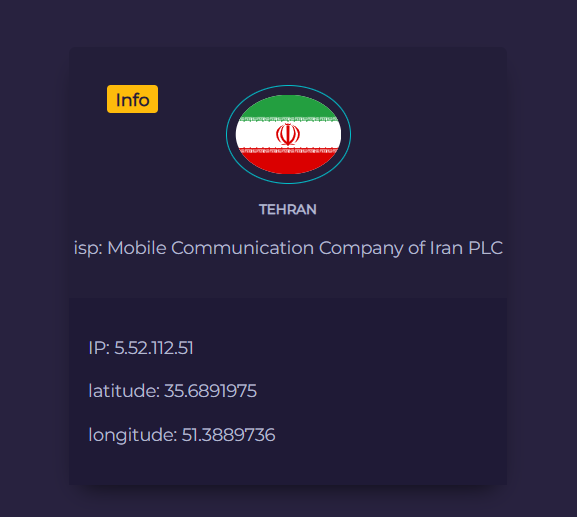

markdown
Copy
Edit
# 🌐 IP Info Viewer

A simple React application that displays a user's IP address and related geographic/network information using an IP geolocation API.

## 🚀 Features

- Displays user's public IP address
- Shows location data (City, Region, Country)
- Shows ISP and timezone
- Responsive UI built with React
- Fetches data from a free IP geolocation API (e.g. ipapi, ipify, or ipinfo)

## 🖼️ Demo



## 🛠️ Tech Stack

- React (Vite or Create React App)
- Axios or Fetch API
- Optional: Tailwind CSS or any CSS framework

## 📦 Installation

1. **Clone the repository**
   ```bash
   git clone https://github.com/maghsood026/geo-ip.git
   cd geo-ip